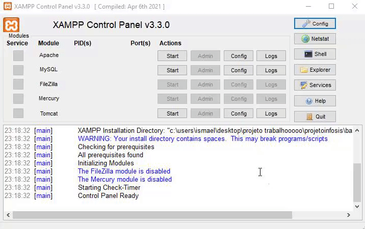
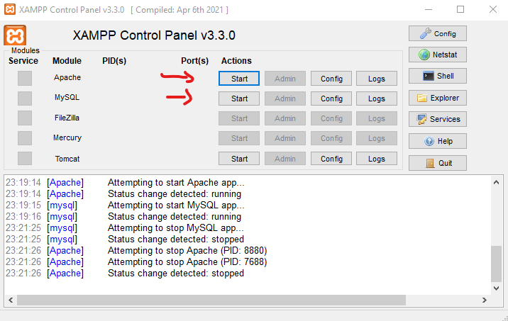
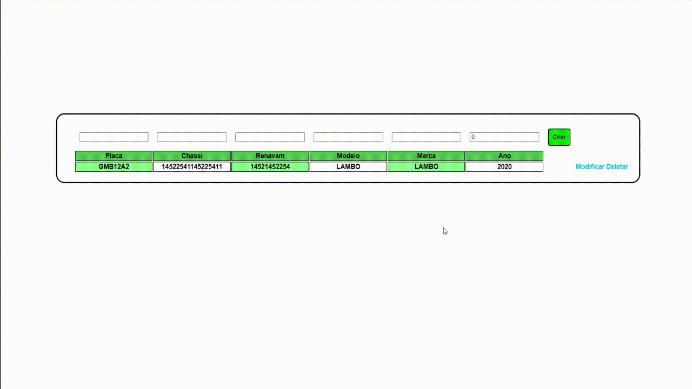

---

# ProjetoInfoSIS

O projeto Infosistemas foi um desafio desenvolvido para ser uma aplicação back-end, mas, foi dado a possibilidade de ser feito o front-end da aplicação em angular.

O desafio foi proposto para ser um CRUD (create, read, update, delete) onde foi solicitado que utilizássemos as tecnologias a seguir.

Front-End:

- Angular 5+ ✔

Back-End com tecnologia REST: 

- Node.js ✔

- Mocha (para testes unitários). ✔

Como solicitado todas as tecnologias anteriores foram implementadas no projeto.

No processo foram aparecendo necessidades para a utilização de alguns modulos, então fiz a implementação dessas tecnologias no projeto.

Back-End: 

- Express

- Axios

- Chai (para os testes unitários)

- MySQL (MySQL existente nas instâncias do XAMPP)

# ## Executando (1)

Para executar é necessário você fazer a instalação dos modulos utilizados pelo node.

Esses modulos são presentes na pasta Back-End\Server, aqui você irá executar o camando.


```bash
    npm install
```

Após o final da instalação você irá abrir a pasta Front-End e executar o mesmo código acima no local em questão.

Fazendo todos esses procedimentos você irá ter que instalar as instâncias globais do Front-End e Back-End.

Pensando na utilização facil do projeto ao usuário, você simplesmente terá que abrir dois arquivos (.bat), um dos arquivos é o angular.bat e o outro é o nodemon.bat...

Após todos os procedimentos, e as instâncias já foram baixadas.

Vamos agora para a parte principal como executar por completo o projeto.

## Se seu windows é 32bits o XAMPP arquivo necessário para a comunicação com o banco de dados, não será executado.

Ok, agora que todas as informações necessárias foram envolvidas, vamos iniciar o script para começar a implementar.

Para executar abra um prompt de comando na pasta ProjetoInfoSIS, e execute o comando abaixo.

```bash
    npm run exec
```

Ou clique no iniciar.bat na pasta ProjetoInfoSIS\

Pronto agora é aguardar o resultado...

# ## Executando (2)

Caso a primeira forma de execução seja falha.

Você pode executar tudo manualmente.

Siga os passos para executar sem complicações.

#  1 - Faça a instalação dos modulos globais:

```bash
    npm install -g @angular/cli
```

```bash
    npm install -g nodemon
```

#  2 - Faça a instalação dos modulos locais de cada aplicação:

- Front-End:

Entre na pasta Front-End\ e execute o comando no prompt de comando

```bash
    npm install
```

- Back-End:

Entre na pasta Back-End\ em seguida Server\ e execute o comando no prompt de comando

```bash
    npm install
```

#  3 - Faça a execução do server XAMPP(64 bits):

Entre na pasta Back-End\ em seguida XAMPPSERVER\ e execute o Executável (xampp-control.exe).

Para abrir o servidor, você irá ativar o APACHE server e o MySQL server.

Observe o GIF e a Imagem aseguir:






---

#  4 - Faça a execução do ANGULAR SERVER:

Entre na pasta Front-End\ e execute o comando no prompt de comando

```bash
    ng serve
```

Com esse comando você faz a ação de execução dos dados por completo do Angular.

---

# (OPCIONAL) 5 - Faça o teste unitário.

Entre na pasta Back-End\ em seguida Server\ e execute o comando no prompt de comando

```bash
    npm run test
```

Com esse comando você fara o teste unitário completo no CRUD (create read, update, delete) da API.

# Conclusão

O desafio foi construído em 5 dias, e todas as aplicações solicitadas foram atendidas de acordo com a necessidade do cliente.

Na sequência você irá verificar um GIF mostrando o funcionamento do projeto.



Esse projeto foi bastante desafiador, meus conhecimentos com desenvolvimento em angular não eram aprofundados, mas como gosto de aprender novas ferramentas de trabalho estudei e implementei o estudo no projeto.

Assim o resultado desse projeto foi benéfico para meus conhecimentos, e dessa maneira outras pessoas podem verificar e ajudar a implementar algo partindo desse projeto a seus projetos pessoais.


