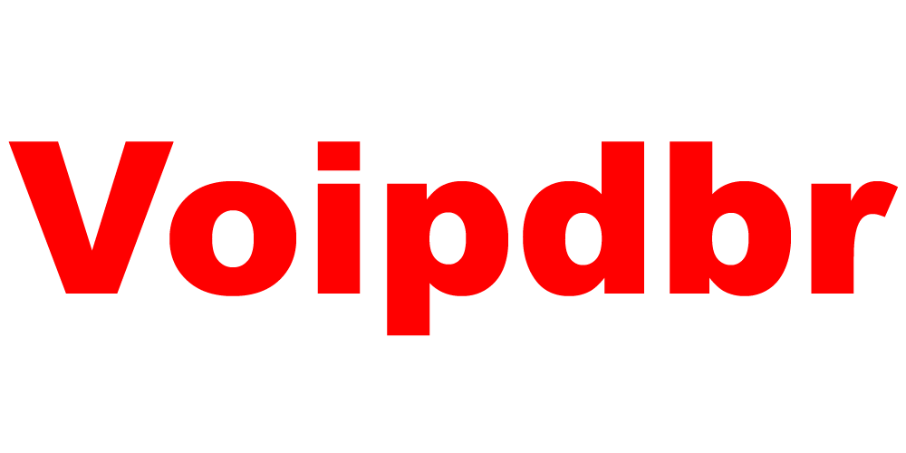

---

# ProjetoInfoSIS

O projeto Infosistemas foi um desafio desenvolvido para ser uma aplicação back-end, mas, foi dado a possibilidade de ser feito o front-end da aplicação.

O desafio foi proposto para ser um CRUD (create, read, update, delete) onde foi solicitado que utilizássemos as tecnologias a seguir.

Front-End:

- Angular 5+ ✔

Back-End com tecnologia REST: 

- Node.js ✔

- Mocha (para testes unitários). ✔

Como solicitado todas as tecnologias anteriores foram implementadas no projeto.

No processo foram aparecendo necessidades para a utilização de alguns modulos, então fiz a implementação dessas tecnologias no projeto.

Back-End: 

- Express

- Axios

- Chai (para os testes unitários)

# ## Executando (1)

Para executar é necessário você fazer a instalação dos modulos utilizados pelo node.

Esses modulos são presentes na pasta Back-End/Server, aqui você irá executar o camando.


```bash
    npm install
```

Após o final da instalação você irá abrir a pasta Front-End e executar o mesmo código acima.

Fazendo todos esses procedimentos você irá ter que instalar as instâncias globais do Front-End e Back-End.

Pensando na utilização facil do projeto ao usuário, você simplesmente terá que abrir dois arquivos (.bat), um dos arquivos é o angular.bat e o outro é o nodemon.bat...

Após todos os procedimentos, as instâncias já foram baixadas.

Vamos agora para a parte principal como executar por completo o projeto.

## Se seu windows é 32bits o XAMPP arquivo necessário para a comunicação com o banco de dados, não será executado.

Ok, agora que todas as informações necessárias foram envolvidas, vamos iniciar o script para começar a implementar.

Para executar abra um prompt de comando na pasta ProjetoInfoSIS, e execute o comando abaixo.

```bash
    npm run exec
```

Pronto agora é aguardar o resultado...